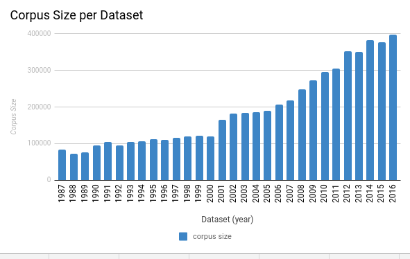
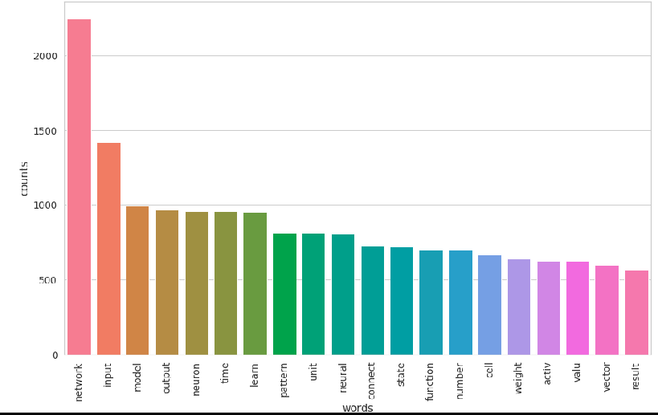
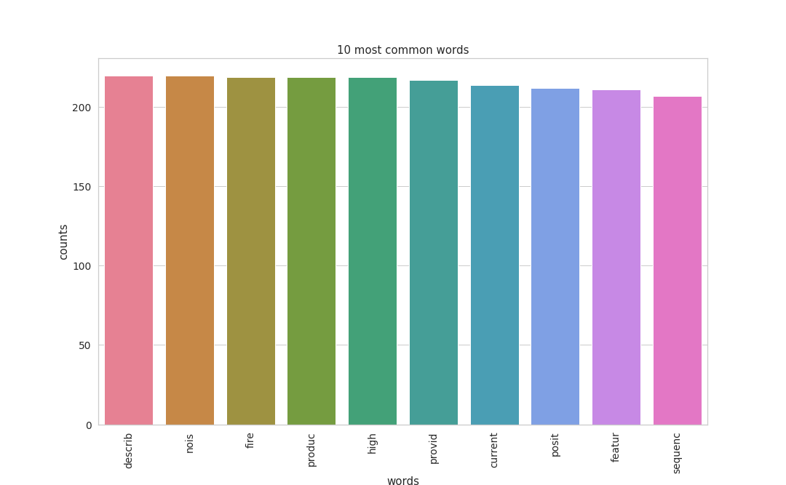
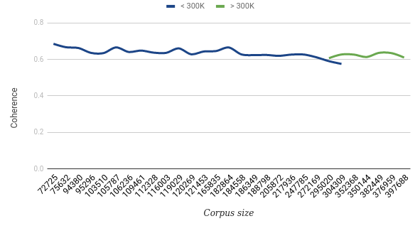
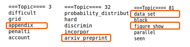
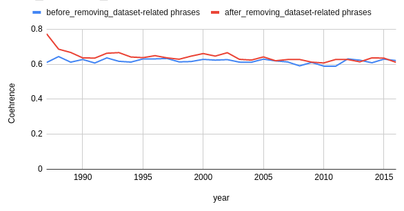
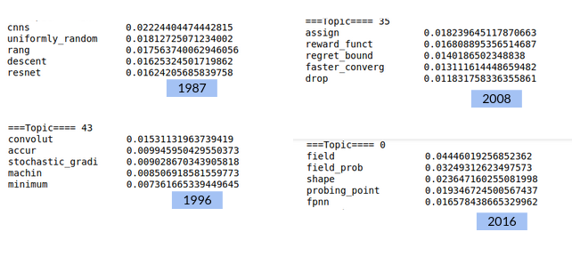

## Abstract

With the advent of large sets of PDF files in several scientific applications, such as bioinformatics and neuroscience, there is a growing need to automatically identify a list of top-K topics in each set. This list could be used later to predict descriptions, keywords, or even cluster datasets.

In this project, I will develop a machine learning (ML) model for identifying a list of top-K topics in a set of papers. The model will be implemented using Apache Spark and MLlibm Apache Spark Machine Learning Lirbary. My project will use a dataset containing 6397 articles.

In this project, I will study the Toronto Paper Matching System TPMS[2] and reuse some of the features used by its ML model. To the best of my knowledge, there is no Spark-based implementation for these features or TPMS.

## Introduction

####      Context

The continuously increasing  amount of data we generate coupled with the various formats pose many challenges  in how we store and read it. For this reason, it is inevitable nowadays in the field of big data to use the adequate technologies such as Apache Spark to process this voluminous and varying data. Data processing is an essential step to extract knowledge which will impact many fields such as Neuroscience and bioinformatics. These fields heavily rely on human intervention which requires a lot of time to read reports and understand them.

####       Objective and Presentation of the problem

For this reason, in this project I will work on creating a scalable system to identify the top-k topics (word sets) covered by a set of PDF files. The list of the top-k topics will be handy in generating a set of categories labelling a given set. It will be a milestone towards predicting descriptions or keywords for a given dataset or even caption an image related to a given set of PDF files.

####         Related Work

The Toronto Paper Matching System (TPMS)[1] has been implemented to find the suitable reviewer for a paper. The system was widely adopted by several top conferences such the Very Large Data Bases conference (VLDP) and the Neural Information Processing System (NeurIPS). In fact, TPMS, using the publications of a reviewer can assess their expertise by assigning them a score. This score is the metric the TPMS relies on to predict the affinity between a given paper under review and a potential reviewer. Even though the TPMS has different end than my project's, they still have a common ground. In fact, the TPMS uses the publication to score the expertise of a reviewer. I will alter this part in order to reflect the top-k topics in a given set of PDF files. In addition, the TPMS has a limitation which I will be addressing in my project which scalability by using Apache Spark.

## Materials and Methods

####         Dataset

The dataset I will be using to implement my project is a list of papers published in the Neural Information Processing Systems conference (NeurIPS) between 1987 until 2016[6]. The dataset contains 6397 articles in total (approximately 5.5 GB) covering a wide range of topics including Artificial Intelligence, statistics, and neuroscience. As this is an unsupervised machine learning problem, the data does not contain any labels. The total number of processed words is in the range of 5 744 551.

​ 
Fig 1: Corpus Size per Dataset

To further give more details about the dataset, Fig 1 shows the number of processed words per year. The graph shows that the size of the corpus increases every year simply because the number of accepted papers increases every year. The number of words ranges between 8000 and 400 000.

####         Technologies

In this section, I will be giving details about the technologies used in each of the steps of the pipepline including: Data preparation, Data preprocessing, training and evaluation.

##### Data preparation

My project is about analyzing academic papers in PDF format so it is important to parse my data using the adequate tools. I have investigaed multiple python packages including pdfminer[8], pdf2txt[9], and Tika[11]. However, Tika was the best to use as it provides a less complex APIs to use compared to pdfminer and better parsing capabilities than pdf2txt. In fact, Tika is a python library for Apache Tika, a toolkit [that]  detects and extracts metadata and text from over a thousand different file types[11]

Addtionally, as the dataset is composed of a large dataset and to address the limitation of scalability, the project will be implemented  using pyspark, the python API of Apache Spark and the Machine Learning lirbary (MLlib). Apache Spark has been used in multiple applications such as finance and science. It has been adopted by more than 1000 companies[5]. In fact, Apache Spark is one of the most famous tools used to process a large amount of data thanks to its high performance compared to other tools such as Apache Hadoop. It enables iterative computation making its MLlib faster and more accurate. The performance of Spark is derived from distributed in-memory computation, lazy evaluation that helps in internally optimize the execution of transformations, and abstraction which improves usability.

Hence, in order to prepare the large number of files for the next step in the pipeline,  both Apache Tika and Apache Spark helped read and store the data to be pre-processed.

##### Preprocessing

The data to pre-process included all the content of the PDF files starting from the abstract and excluding the acknowledgment and references parts. The first part of this step of the pipeline was about eliminating special characters such as but not limited to (, - _ + * [ ] ( ) ! ? . # $ @) in addition to any numeric. 

Furthermore, our text data need to be tokenized using the pre-process function provided by Gensim (Generate Similar)[10]. Gensim is topic modeling python library which is documented as the most robust, efficient and hassle-free piece of software to realize unsupervised semantic modeling from plain text[10]. So Gensim is the most adequate package to use because its purpose suits our needs.

After tokenization, removing the stop-words from out corpus is essential. The stop-words are tokens that have little or no value  or significance is analyzing our data. The set of stop-words used belong to the Gensim package: It includes 337 words such as reflexive pronouns, common adverbs like 'mostly', 'thereby', 'somehow' and, common verbs like 'be', 'become', 'do'.

After creating a list of tokens for the data we have, it is important to note that some terms frequently occur together such as (convolution, layer), (supervised, learning), and (neural, networks). However, the format our data does not reflect this observation. For this reason, creating bigrams - phrases composed of two single words is needed. To achieve this, Gensim's Phrase model help create n-grams. It is however, worth mentioning that in our pipeline, that our final data solely included bi-grams but can be extended to included trigram or n-grams in general.

As our model the Latent Dirichlet Allocation (LDA) which we will discuss in the algorithm section, accepts the corpus and the frequency of each term in it. it is important to reduce inflectional forms of our corpus. For instance, researcher, researcher, and research should map to research because semantically these tokens convey the same idea. Hence it is important to reflect this observation in the data provided to our model via stemming and lemmatization. Therefore, the technologies used are SnowballStemmer and WordNetLemmetizer provided by the Natural Language Toolkit[7] package in python.

Calculating the frequencies of our phrases in essential to work with the LDA implementation in Spark. For this reason, we used the CountVectorizer class provided by the Machine Learning (ML) library in pyspark. Internally, the class assigns an id to each distinct phrase and calculate each corresponding frequency. Therefore the result is a dataframe and each row contains a sparse vector. In other words, we can think of  our dataframe as a sparse matrix. The sparsity is adequate to optimize the heavy calculation performed by our model.

 
''

​								 
Fig 2: Frequency before removing 5%

​								
Fig 3: Frequency after removing 5%

Fig 2 shows the 20 most frequent words in our corpus in 1987.  The bar chart shows that frequencies are not balanced which may influence our results. For this reason, 5% of the corpus was eliminated in the following way: 2.5% of the most frequent and 2.5% of the least frequent. Fig 3 illustrates the result obtained  after removing 5% of the corpus in 1987. The bar chart illustrates that the frequencies become more balanced avoiding as a result having a biased model. In fact, even some quantitative results for the dataset in 1987 show a improvement in the coherence which went from 0.586 to 0.626 for the best model after the hyper-parameter tuning. Subsequently the quantitative figures will be further explored in the results and discussion parts

##### Training

The LDA model, discussed in details in the Algorithm part, belongs to the ML library offered by Apache Spark. To optimize the inference part of our model, we use the EMLDAOOtimizer[1] provided as well by spark. 

##### Coherence

Spark does not provide an implementation of a coherence metric to evaluate the results of our model. For this reason and using the obtained topics, the CoherenceModel provided by gensim help evaluate the model. The coherence model accepts different evaluation measures. But the c_v measure was used in our work because on average it has been reported to be the best.[4].

#### Algorithm

##### Model

My project will revolve around implementing an unsupervised algorithm capable of listing a number of topics covered by the set of papers I will be processing. Hence the best tools provided by Apache Spark ML library are the topic Modeling algorithms, specifically the Latent Dirichlet Allocation (LDA) a generative probabilistic model of a corpus. Its basic idea is that documents are represented as random mixtures over latent topics, where each topic is characterized by a distribution over words[4]. The model will be able to return a list of words per topic. The number of expected topics and the number of words per topic will be passed as parameters to the model. 

##### Training

Initially, we started with a search grid in order to get the best hyper-parameters. The investigated hyper-parameters were the number of topics and the maximum number of iterations which Table 1 summarizes. As Table 1 shows, the investigated number of topics differ depending on the size of corpus. A thorough explanation will be mentioned in the results part.

|                              | \|corpus\| < 300 000  | \|corpus\| > 300 000 |
| ---------------------------- | :-------------------: | :------------------: |
| Number of topics             | [20, 30, 50, 70, 100] |   [100, 120, 150 ]   |
| Maximum number of iterations |     [20, 50, 80]      |     [20, 50, 80]     |

​									

Table 1: Hyper-parameters 

Additionally the hyper-parameter tuning help in determining the optimal parameters to use in order to train our model to better generalize.		 

##### Evaluation

As we lack the ground truth, I will evaluate the performance of the LDA model using Topic Coherence Measures. The coherence is defined as the median of pairwise word semantic similarities formed by top words of a given topic. Hence using these metrics we can help distinguish between the good and bad topics based on the interpret-ability of the words each topic contains[4]. Based on the coherence measures, I will work on improving my model by further pre-processing my data through eliminating the words that appeared in the result but semantically are not meaningful. 

Specifically we will use the c_v measure mentioned in the evaluation part in the technologies. The measure is based on a sliding window of size 101 to get the co-occurrence of the words, then using the Normalized Pointwise Mutual Information, a measure of association between two phrases p1 and p2 is calculated. At the end, the obtained vectors are used to calculate the cosine similarity.

### Results

------

#### Training

##### Hyper-parameter Tuning

In order to find the optimal models, it is important to proceed with hyper-parameter tuning using search grid. At first, we started our search over 5 values for the number of topics hyper-parameter as summarized in Table 1. 

​								
Fig 4 : Coherence vs Corpus size for 1988 - 2010

Fig 3 shows the variation of the coherence values for the best topic in terms of the corpus size for the 1988 - 2010 datasets (dataset in 1987 was excluded because the coherence is relatively high 0.77). The graph shows that the coherence decreases as the size of the corpus increases. It started at 0.7 to reach 0.58 approximately. Fig 4 also shows a decreasing trend-line projecting a low coherence for the upcoming datasets because they have larger corpora as Fig 1 illustrates. In addition, we observe that the coherence drops below 0.6 for a corpus of size larger than 300 000.

Given the previous observations, a different set of values for the number of topics hyper-parameter will be investigated when the corpus size is larger than 300 000. These values range between 100 and 150 in order to have a more optimal generalization for our final model.

​							Fig 5: Coherence vs Corpus Size for dataset 1988 - 2016

Fig 5 shows the variation of the coherence of the best models in terms of the corpus size for 1988 - 2016 datasets. The graphs in blue and green are for models trained on data of size smaller and larger than       300 000 words respectively. The coherence of the models run on corpora larger than 300 000 words is above 0.6 in contrast with what had been projected by the trend-line in Fig 4. Hence increasing the number of topics for a large corpus help the model better generalize.

##### Dataset-related phrases

The LDA model generates latent topics that the data spans over. Each latent topic is a set of phrases that are semantically-coherent and each token comes with its corresponding weight (importance) relative to its topic. The topics returned by the models after the hyper-parameter tuning include some of the phrases that are related to the nature of the dataset. A sample of these words are reported in Fig 6. Hence, it is important to remove them.

​								      

Subsequently we wanted to investigate the effect of removing the dataset-related phrases on the coherence. In fact, Fig 7 shows the variation of the coherence before and after removing the dataset-related token. Generally the graphs show that the value of the coherence has improved. On average the improvement is 0.02. 

​			
Fig 7: Coherence per dataset before and after removing dataset-related
 phrases

#### Results

In this section, we present a sample of the actual latent topics generated by some of the final trained models. Fig 8 reports four latent topics for different years. From the semantically-coherent words and their respective weights we can conjecture the different corresponding topics in Table 2.

​					                     
Fig 8: A sample of the latent topics

| 1987                                                         |
| ------------------------------------------------------------ |
| Given the importance of the term cnns and the presence of resnet. We can say that the topic is about image recognition using the Residual Neural Networks. |
| **1996**                                                     |
| Given the terms machin and convolut, we can say that the topic may revolve about Convolution Neural Networks (CNNs). To be more specific and since we have the terms accur, stochastic_gradi, and minimum, the topic is probably about optimizing CNNs. |
| **2008**                                                     |
| Given the presence regret_bound and reward_funct, we can say that the topic is about reinforcement learning. the terms drop and faster_converg refer to optimization. So probably the topic is about optimizing an algorithm in reinforcement learning. |
| **2016**                                                     |
| Given the terms fpnn, field, and field_prob we can say that probably the topic is about Field Probing Neural Networks. |

​				  
Table 2: Possible topics inferred from the terms reported in Fig 8

### Discussion

------

#### Relevance 

Our project intends to identify top-k topics covered by a set of PDF papers using a scalable system. To address these two features, we used one of the Topic Modeling techniques, the Latent Dirichlet Allocation (LDA) and Spark. I was able to prepare my data by parsing it into text that I subsequently pre-process in order to run my model. I was able to investigate several hyper-parameters via search grid and evaluate the performance of the my models using the best coherence measure reported in the literature. The final model reports the latent topics composed each of semantically-coherent words that converge to one topic. Hence by building a scalable machine learning pipeline, we could report the topics that a given set of PDF documents covers.

#### Limitation

The reported results show there is a room to improve our model. In fact, the greatest limitation is parsing the data and covert the PDF documents. The limitation lies within the tools used to read the PDF documents even though Apache Tika, after comparing its performance with other tools, seemed to be the most efficient.

Another limitation is that the Latent Dirichlit Allocation model report latent topics. the topics need expert in-depth knowledge in Machine Learning, Artificial Intelligence, and Neuroscience to adequately and specifically interpret the topics related to our dataset.

Furthermore, I had to select the tokens that are dataset-related. The task was time-consuming and not very efficient as the improvement was only 0.02 on average. The improvement was not remarkable because the removed tokens are only the ones that appear in the result. However some irrelevant ones remain in the vocabulary on which we train our model.

#### Future Work

In terms of interpret-ability, an expert's knowledge is essential to interpret the words in a given latent topic and help determine the most adequate actual topic.

In terms of performance, automatically determining the dataset-related words  instead of manually selecting them will have a better coherence. In fact, by automatically identifying these tokens, our vocabulary used to train the model will be more relevant to our task. Additionally, as we run our model on the a local machine with limited resources, we can instead use a larger cluster to leverage the capacity of spark and process larger datasets. For instance we can run our model on the datasets of 2019 which is approximately 1.5 GB.

In terms of applicability, we can now use the model to generate keywords or description that can be used to cluster sets of PDF academic articles.

------

## References

[1] Arthur Asuncion, Max Welling, Padhraic Smyth and Yee Whye Teh. 20012.On Smoothing and Inference for Topic Models.arXiv:1205.2662.https://arxiv.org/pdf/1205.2662.pdf

[2] Charlin, L., & Zemel, R.S. (2013). The Toronto Paper Matching System: An automated paper-reviewer assignment system.

[3] David M. Blei, Andrew Y. Ng, and Michael I. Jordan. 2003. Latent dirichlet allocation. J. Mach. Learn. Res. 3, null (March 2003), 993–1022.

[4] Michael Röder, Andreas Both, and Alexander Hinneburg. 2015. Exploring the Space of Topic Coherence Measures. In Proceedings of the Eighth ACM International Conference on Web Search and Data Mining (WSDM ’15). Association for Computing Machinery, New York, NY, USA, 399–408. DOI:https://doi.org/10.1145/2684822.2685324

[5] Matei Zaharia, Reynold S. Xin, Patrick Wendell, Tathagata Das, Michael Armbrust, Ankur Dave, Xiangrui Meng, Josh Rosen, Shivaram Venkataraman, Michael J. Franklin, Ali Ghodsi, Joseph Gonzalez, Scott Shenker, and Ion Stoica. 2016. Apache Spark: a unified engine for big data processing. Commun. ACM 59, 11 (October 2016), 56–65. DOI:https://doi.org/10.1145/2934664

[6] https://nips.cc/

[7] https://www.nltk.org/

[8] https://pdfminersix.readthedocs.io/en/latest/

[9] https://pypi.org/project/pdftotext/

[10] https://radimrehurek.com/gensim/

[11] https://tika.apache.org/

